# Лабораторная работа №16  
## Знакомство с POSIX потоками (pthread)

---

## Задание 1  
Создаём дочерний поток с помощью `pthread_create`, затем проверяем на ошибку создания. Главный поток выводит строки `parent N`, а дочерний — `child N`. В конце объединяем потоки с помощью `pthread_join`.

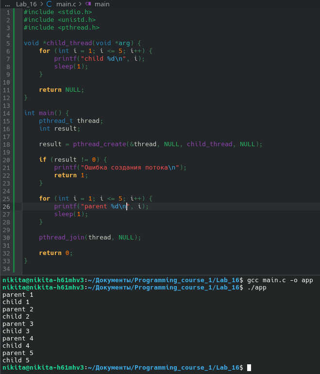

---

## Задание 2  
Переносим `pthread_join` до вывода главного потока.

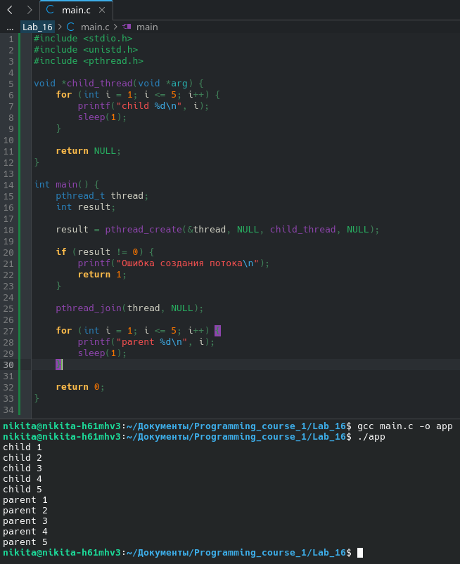

---

## Задание 3  
Создаём массив строк `strings` для удобства вывода. Создаём дочерние потоки в цикле, передавая каждому `strings[i]`. Объединение потоков также заносим под цикл.

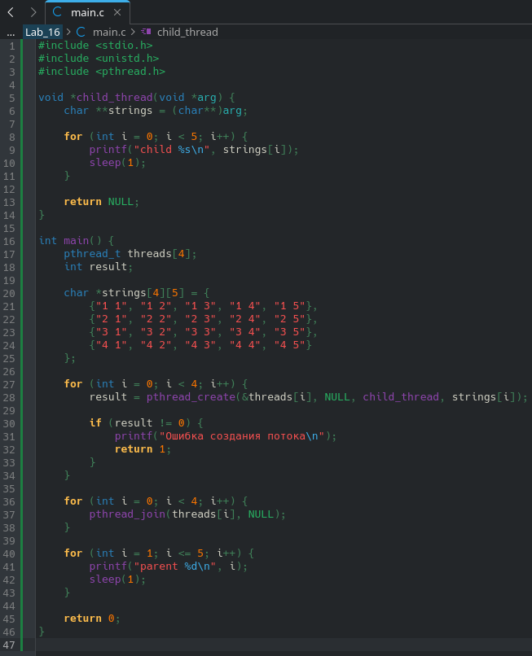
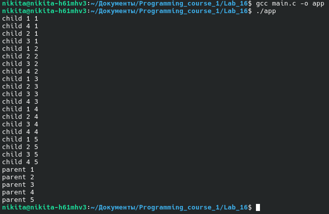

---

## Задание 4  
Досрочно завершаем все потоки через некоторое время с помощью `pthread_cancel`.

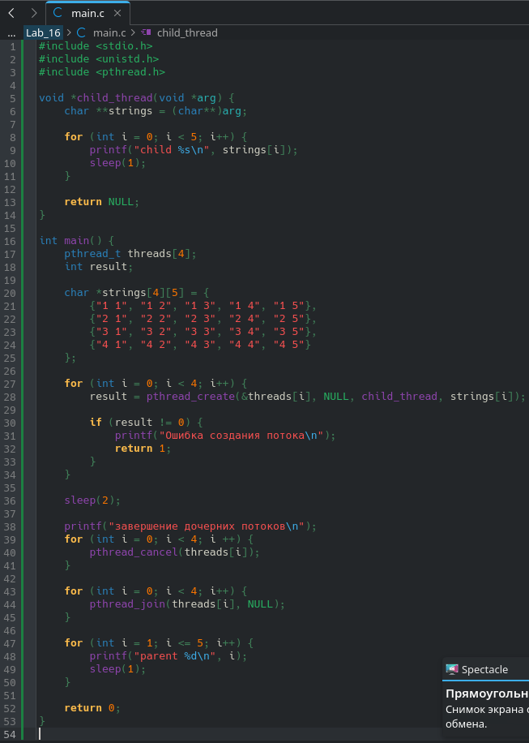
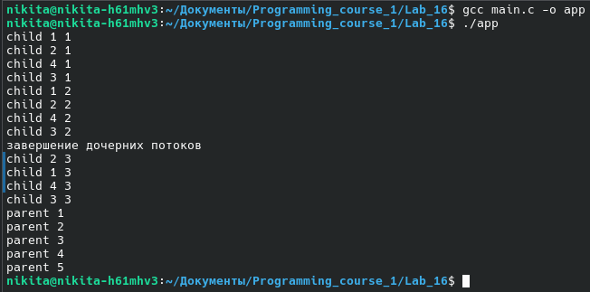

---

## Задание 5  
Перед завершением каждый поток печатает сообщение. Используем `pthread_cleanup_push()`.

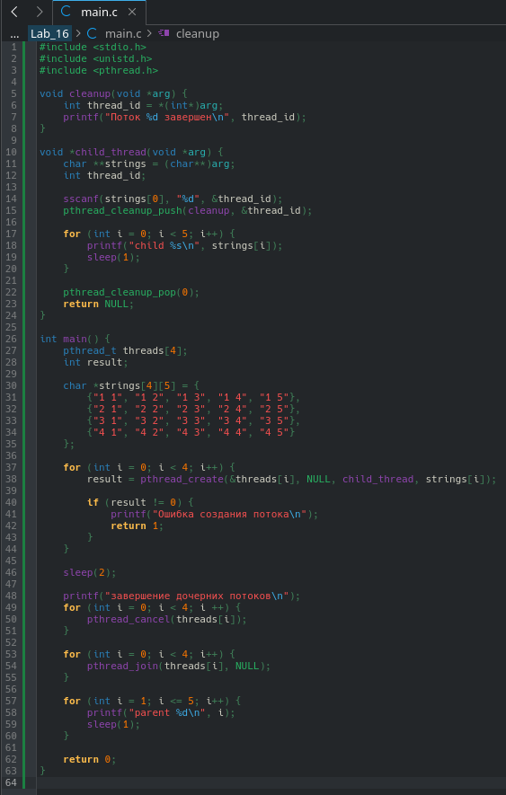
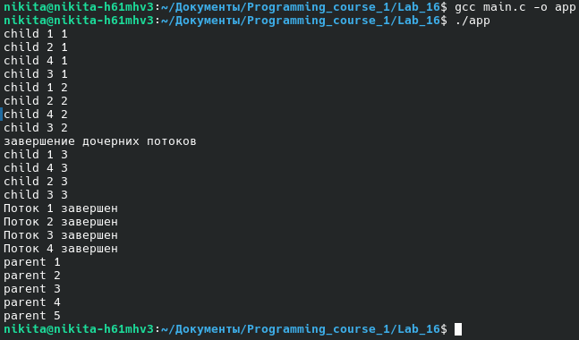

---

## Задание 6  
Реализуем шуточный алгоритм сортировки **sleepsort**.

Для каждого элемента массива создаётся поток, которому передаётся значение — время ожидания перед выводом. Вместо `sleep` используем `usleep`, но для точности считаем десятками миллисекунд (`* 10000`).

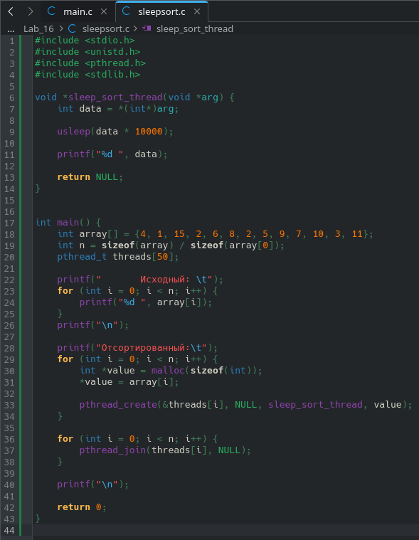
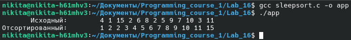

---

## Задание 7  
Синхронизируем родительский и дочерний потоки с помощью **mutex** и **флага**.

Флаг определяет, чья очередь выводить данные. Критическая секция (`flag` и `printf`) обрабатывается через `pthread_mutex_lock` и `pthread_mutex_unlock`. Без mutex возникла бы гонка потоков, и порядок вывода строк мог бы нарушиться.

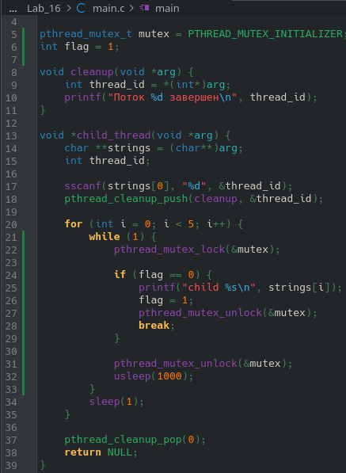
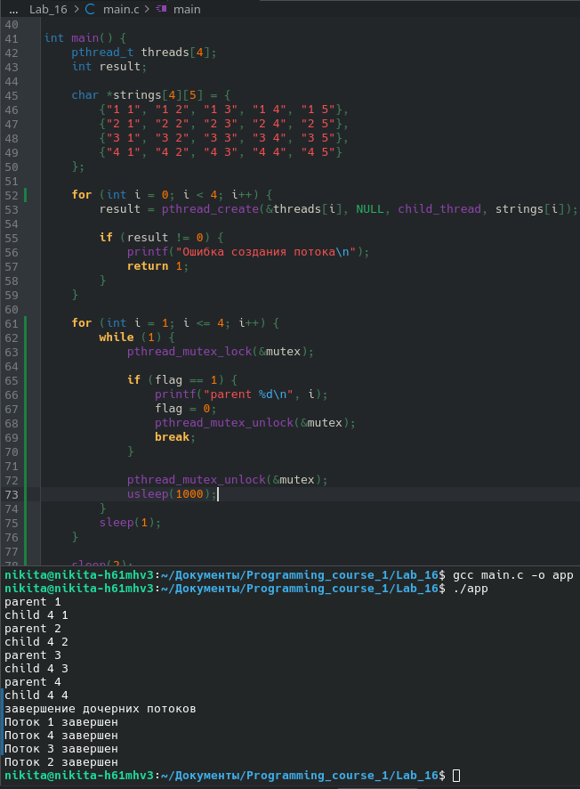

---

## Задание 8  
Реализуем **перемножение квадратных матриц** с использованием потоков.

Каждому потоку выделяется равная часть матрицы **A**. Поток перемножает её с **B** и записывает результат в **C**.

Сначала объявляем функции работы с матрицами:  
`multiply_matrix`, `create_matrix`, `free_matrix`, `print_matrix`.  
Создаём три матрицы и проверяем работу функций без потоков.

Затем переписываем `multiply_matrix` в функцию дочернего потока `child_thread`.  
В `main` обрабатываем аргументы командной строки (размер матриц, количество потоков).  
Делим матрицу **A** между потоками, запускаем потоки, ждём их выполнения и выводим результат.

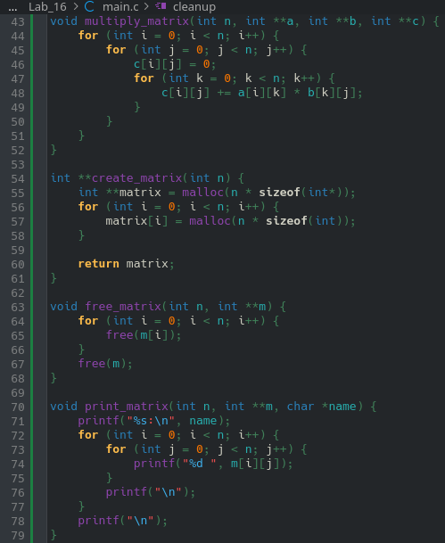
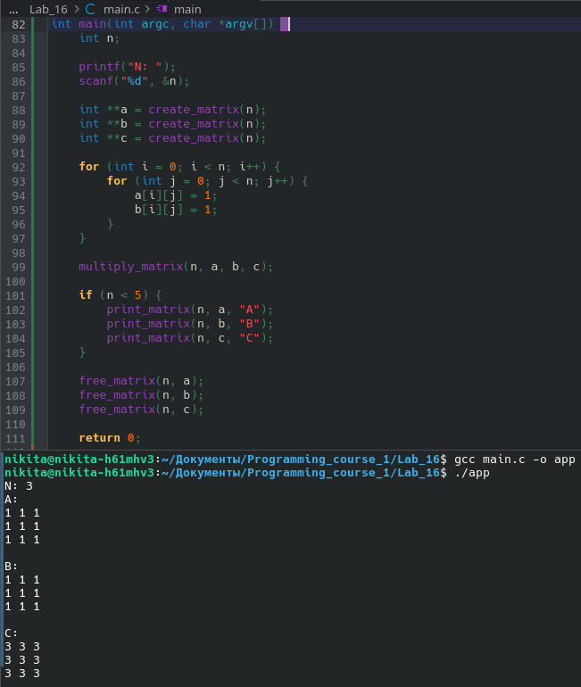
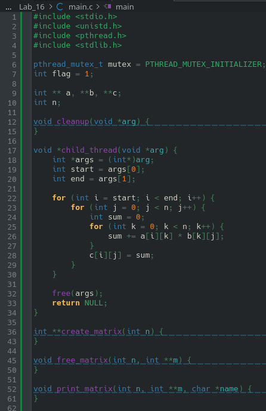
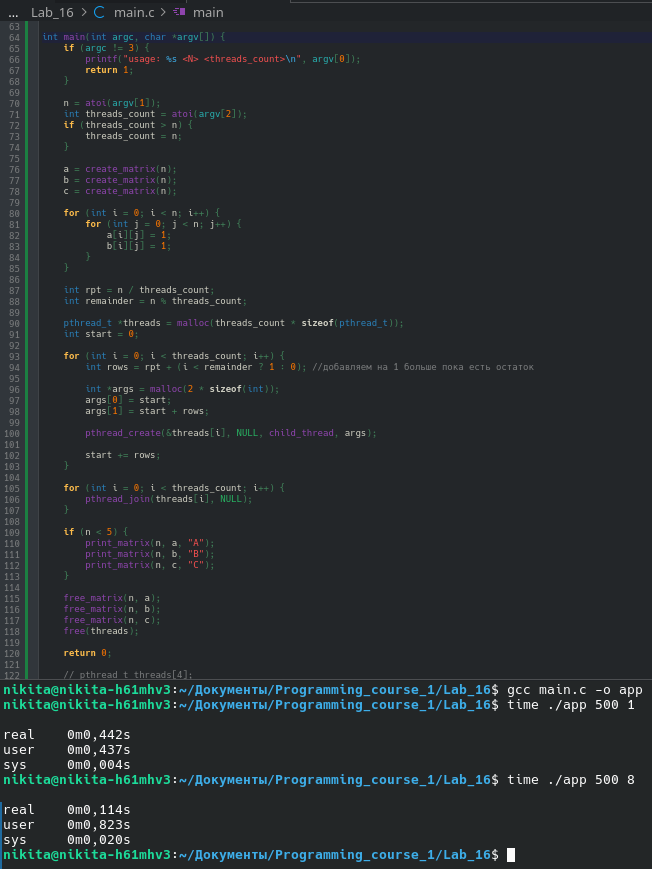

---

## Задание 9  
Замеряем время выполнения при:

- размерах матриц **N** от **250** до **2500**;  
- количестве потоков от **1** до **128**.

Замеры выполнялись с помощью библиотеки `<sys/time>`.  
Графики построены в **gnuplot** на основе выводов программы.

### Оптимизация O0

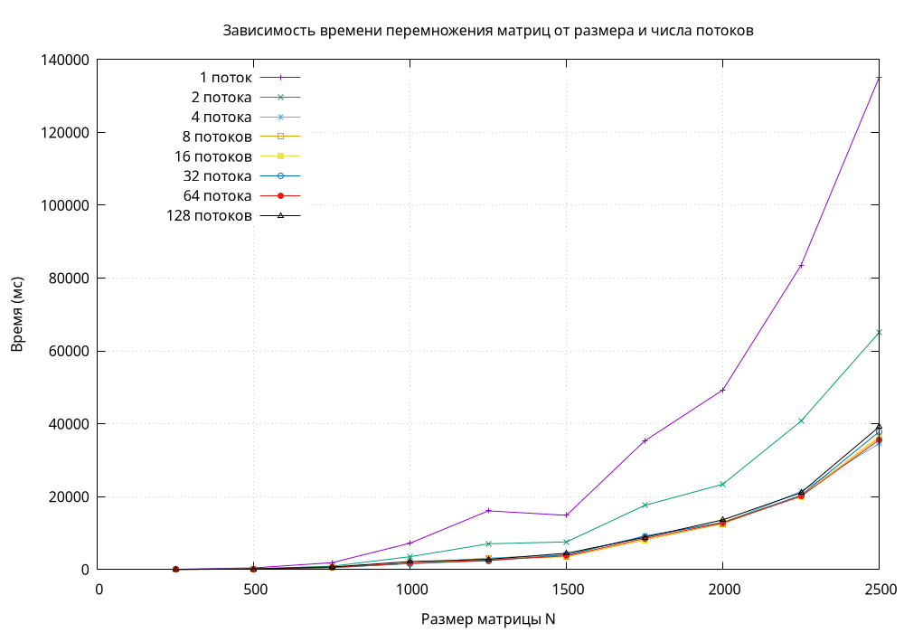

### Оптимизация O2

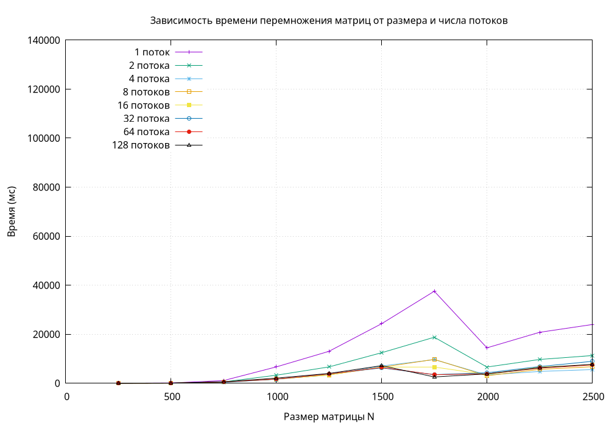

### Оптимизация O3

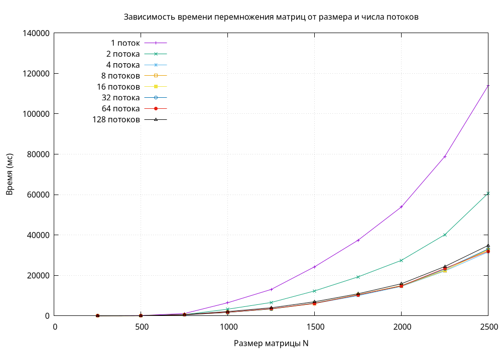

**На графике O3** хорошо видно, что больше **8–16** потоков смысла запускать нет.  
Это ограничено характеристиками процессора `i7-3770` (4 физических ядра / 8 логических (hyper threading)).  
Запуск 32 или 128 потоков не даёт прироста — потоки выполняются по очереди.

**На графике O2** видно, что 128 потоков иногда работают быстрее. Это связано с **размером кэша процессора** (L3 8МБ): часть матрицы **A** и матрицы **B** и **C** помещаются в кэш, что ускоряет работу.
